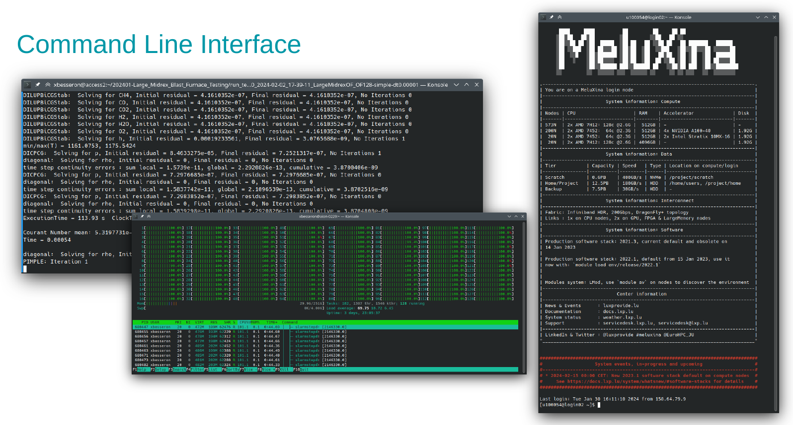
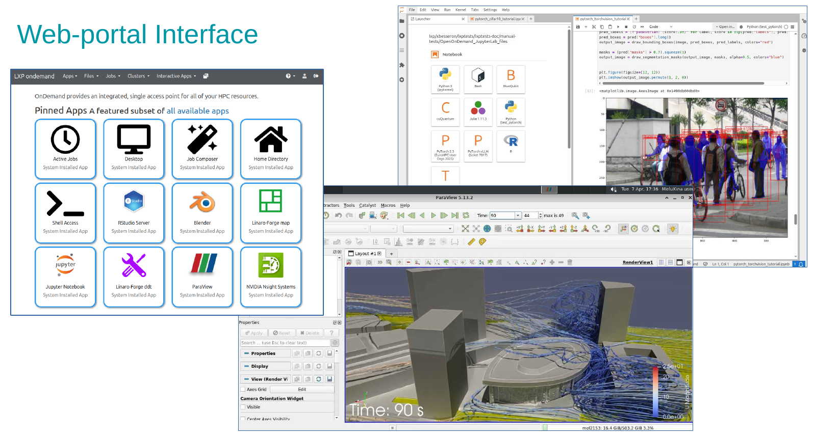
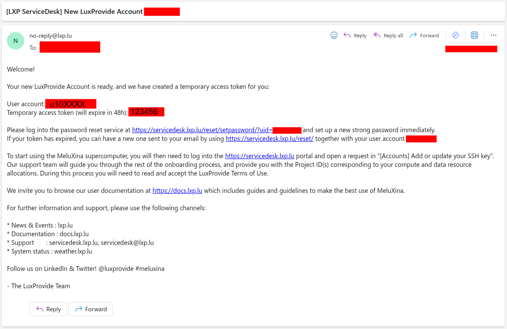
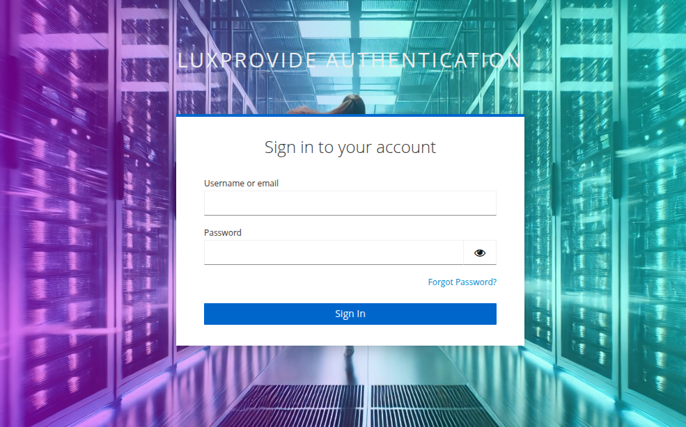
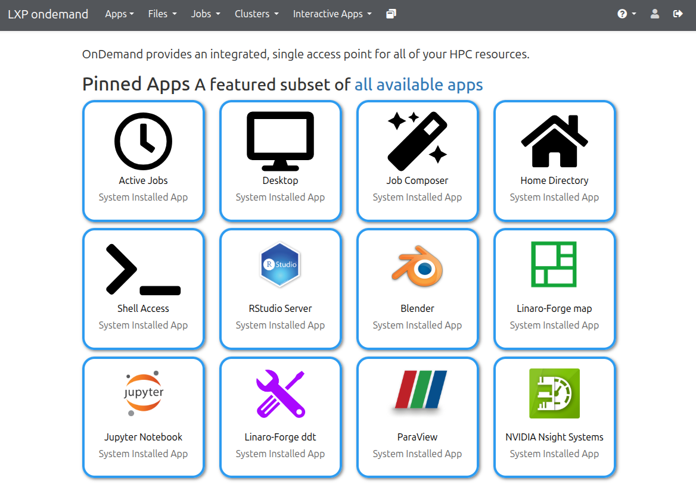

# Hands-on: Configuring your access to MeluXina

This part will help you to configure your access to MeluXina.

{ width="460"}
{ width="460"}

---

## Check your account username and token

{ width="520" align="right" }

If this is the first time that you're accessing MeluXina, you have received an email with your login information.
This email (example on the right) includes two important pieces of information to set up your account:

- Your **account username**, in the format `u10XXXX`
- Your **token** (temporary password), in the format `123456`

Then, you have to follow the **link in the email**, use your temporary credential to login and setup a new strong password. Make sure to remember your username and this password as you will need them later on.

??? abstract "Online Documentation"

    - [Get your service desk password](https://docs.lxp.lu/first-steps/connecting/#get-your-service-desk-password)

---

## Web-portal access

The Open OnDemand web portal provides a graphical interface to access MeluXina services.
It serves as a web-based gateway to the high-performance computing (HPC) environment, allowing users to seamlessly access the command line, manage files, monitor jobs, and run graphical applications directly from a browser without needing to configure SSH locally.

Follow these steps to access the **MeluXina Open OnDemand web-portal**:

1. Open the url of the web-portal: [https://portal.lxp.lu/](https://portal.lxp.lu/). 
2. Enter your **username** (`u10XXXX`) and **password** (set during [onboarding](#setup-your-service-desk-account))
3. If you have enabled **2FA**, you'll be prompted for a one-time code

{.center width="720"}

??? abstract "Online documentation"

    - [How to connect to Open Ondemand](https://docs.lxp.lu/web_services/open_ondemand/howtoconnect/)
    - [Multi-factor authentication setup](https://docs.lxp.lu/web_services/keycloak/)

Upon successful login, you'll land on the Open OnDemand Welcome page with access to:

- **Shell Access**: Terminal interface.
- **Home Directory**: Browse and manage files.
- **Active Jobs**: Monitor your jobs.
- **Desktop**: Run a full desktop environment on a compute node.
- **Graphical applications**: Run GUI applications directly from the portal.

{.center width="720"}

---

[{ width="420" }](https://epicure-hpc.eu/) 
[{ width="320" }](https://luxprovide.lu)
