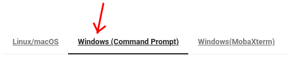

{ width="640" }

# Hands-on: Configuring your access to MeluXina

This part will help you to configure your access to MeluXina.
It consists of three main steps:

1. [Setup your **service desk** account](#setup-your-service-desk-account)
2. [**Command line** access using SSH](#command-line-access-using-ssh-key)
3. [**Web-portal** access](#web-portal-access)

{ width="460"}
{ width="460"}

---

## Setup your service desk account

{ width="520" align="right" }

If this is the first time that you're accessing MeluXina, you have received an email with your login information.
This email (example on the right) includes two important pieces of information to set up your account:

- Your **account username**, in the format `u10XXXX`
- Your **token** (temporary password), in the format `123456`

Then, you have to follow the **link in the email**, use your temporary credential to login and setup a new strong password. Make sure to remember your username and this password as you will need them later on.

??? abstract "Online Documentation"

    - [Get your service desk password](https://docs.lxp.lu/first-steps/connecting/#get-your-service-desk-password)

---

## Command line access using SSH key

!!! info "SSH setup is not strictly required, but recommended"

    The command line interface is often required to use MeluXina.
    
    If the SSH access is too complicated to setup, you can jump directly to the [web-portal access](#web-portal-access) and use the command line from there.

The Command Line Interface (CLI) with Secure Shell (SSH) is the de-facto standard to access remote Linux machines and supercomputing platforms. 
It is fast, lightweight, and secure. The security relies on an SSH key pair (public/private keys) which is tied to a specific machine (e.g., your laptop) which can be granted (or not) access to the supercomputer.

### Setup of SSH Access

Configuring your SSH access to MeluXina requires the following steps that have to be done once for all:

1. [Generating an SSH key](https://docs.lxp.lu/first-steps/connecting/#generating-an-ssh-key-pair)
2. [Uploading your public SSH key](https://docs.lxp.lu/first-steps/connecting/#upload-your-public-ssh-key)

!!! tip

    This setup is slightly different depending on if you work on Linux/MacOS or Windows.
    In the documentation page, make sure to check the instructions specific to your system by clicking on the right tab. 
    
    For example, if you use Windows:
    
       

??? warning "Guidelines to Handle Your SSH Keys"

    Handling SSH Keys can be confusing and intimidating at first.
    It is about security and it should be taken seriously when all the devices are connected to the Internet. Here are a few guidelines:

    - The term "pair of SSH keys" refers to the **public and private keys** associated together.
    - The private key is meant to be **private**: Never share it with anyone! Don't send it by email! (not even to yourself) Don't put it on a Cloud drive (Dropbox, Google Drive, MS OneDrive, etc.).
    - Generate one pair of keys for each of your `account@machine`. Don't try to copy your keys around. It makes it easier to block an access if it gets compromised.
    - Protect your SSH key with a passphrase. Without that, if your laptop gets stolen, your accesses to remote machines get compromised too! Instead, learn to use SSH Agent so you need to type your passphrase only once after booting your laptop.
    - You're not allowed to share your HPC access with another person. If you need to do it for some reason (e.g. debugging issues specific to your account), you should NOT share your private SSH key. Instead, you should authorize the SSH public of the other person to access your account (via the service desk or your `~/.ssh/authorized_keys`)

??? abstract "Online Documentation"

    - [Generating an SSH key](https://docs.lxp.lu/first-steps/connecting/#generating-an-ssh-key-pair)
    - [Uploading your public SSH key](https://docs.lxp.lu/first-steps/connecting/#upload-your-public-ssh-key)

---

## Web-portal access

The Open OnDemand web portal provides a graphical interface to access MeluXina services.
It serves as a web-based gateway to the high-performance computing (HPC) environment, allowing users to seamlessly access the command line, manage files, monitor jobs, and run graphical applications directly from a browser without needing to configure SSH locally.

Follow these steps to access the **MeluXina Open OnDemand web-portal**:

1. Open the url of the web-portal: [https://portal.lxp.lu/](https://portal.lxp.lu/). 
2. Enter your **username** (`u10XXXX`) and **password** (set during [onboarding](#setup-your-service-desk-account))
3. If you have enabled **2FA**, you'll be prompted for a one-time code

{.center width="720"}

??? abstract "Online documentation"

    - [How to connect to Open Ondemand](https://docs.lxp.lu/web_services/open_ondemand/howtoconnect/)
    - [Multi-factor authentication setup](https://docs.lxp.lu/web_services/keycloak/)

Upon successful login, you'll land on the Open OnDemand Welcome page with access to:

- **Shell Access**: Terminal interface.
- **Home Directory**: Browse and manage files.
- **Active Jobs**: Monitor your jobs.
- **Desktop**: Run a full desktop environment on a compute node.
- **Graphical applications**: Run GUI applications directly from the portal.

{.center width="720"}

---

[{ width="420" }](https://epicure-hpc.eu/) 
[{ width="320" }](https://luxprovide.lu)
