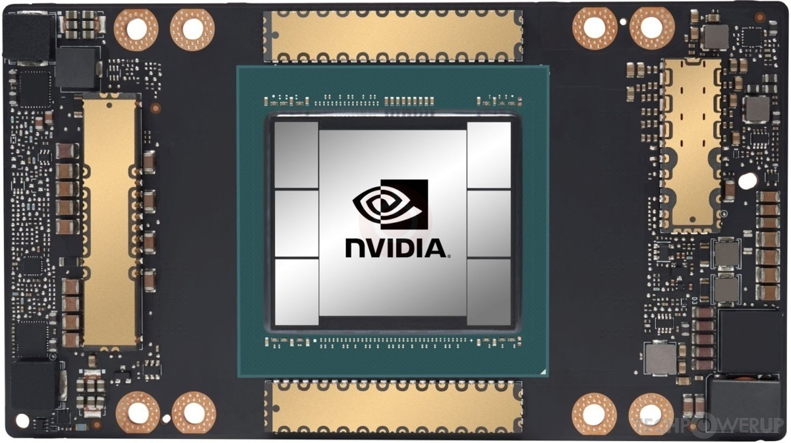
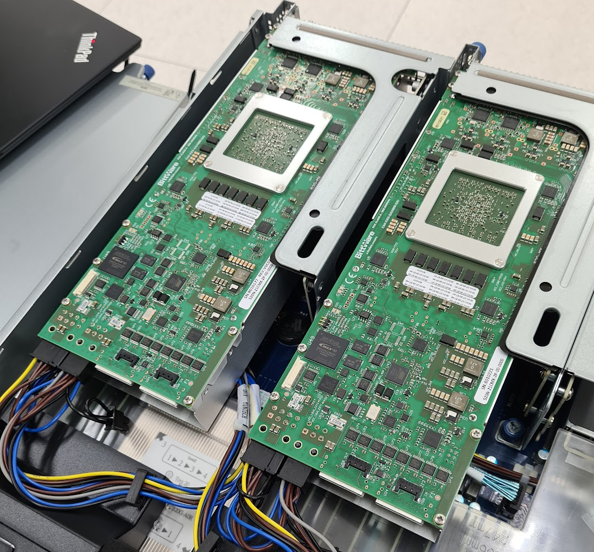
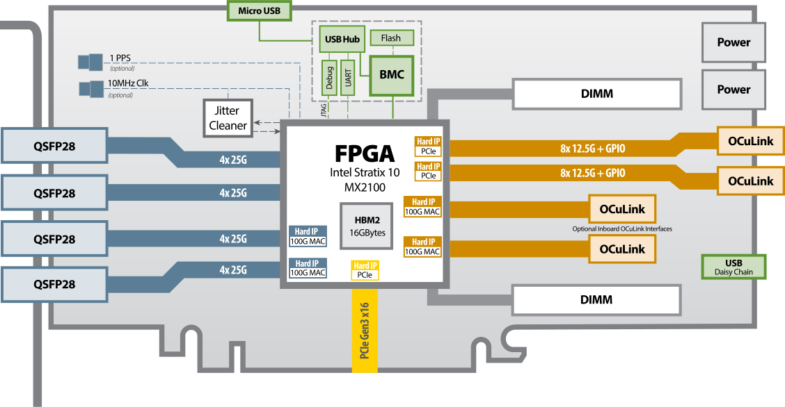

# Rust on MeluXina

## Introduction 

### MeluXina NVIDIA A100 

<center markdown="1">
{align=right width=40%}
</center>

The 200 Accelerator Module GPU nodes are based on the NVIDIA A100 GPU-AI accelerators. Each GPU has 40GB of on-board High Bandwidth Memory and the 4 GPUs on each compute node are linked together with the NVLink 3 interconnect (1,555GB/s memory bandwidth). The A100 supports the Multi-Instance GPU feature, allowing the GPUs to be split up into 7 'independent' with 5 GB each.

The A100 with 108 SMs provides higher performance and new features compared to the previous Volta and Turing generations. Key SM features are briefly highlighted below, check out the [Ampere architecture white paper](https://images.nvidia.com/aem-dam/en-zz/Solutions/data-center/nvidia-ampere-architecture-whitepaper.pdf) for additional details. NVIDIA also provides a [dedicated tuning guide for the Ampere-based GPUs](https://docs.nvidia.com/cuda/ampere-tuning-guide/index.html), enabling developers to take advantage of the new features.

### MeluXina Bittware 520N-MX FPGAs

<center markdown="1">
{align=right width=40%}
</center>

Each of the 20 MeluXina FPGA compute nodes comprise two **BittWare 520N-MX** FPGAs based on the [**Intel Stratix 10 FPGA chip**](https://www.intel.com/content/www/us/en/products/details/fpga/stratix/10/docs.html). Designed for compute acceleration, the 520N-MX are PCIe boards featuring Intel’s Stratix 10 MX2100 FPGA with integrated HBM2 memory. The size and speed of HBM2 (16GB at up to 512GB/s) enables acceleration of memory-bound applications. Programming with high abstraction C, C++, and OpenCLis possible through an specialized board support package (BSP) for the Intel OpenCL SDK. For more details see the dedicated [BittWare product page](https://www.bittware.com/fpga/520n-mx/).

<center markdown="1">
[](images/520N-MX-Block-Diagram-fpgas.svg){: style="height:250px;width:"}

Intel Stratix 520N-MX Block Diagram.
</center>

## Setup

- Connect to MeluXina using:

    * Either using `ssh` on your local machine
    * Or with the [OpenOnDemand portal](https://portal.lxp.lu/). Once logged in,  select "Clusters" and then ">_ Shell Access"

- Clone the repository containing the code
```bash
git clone https://github.com/LuxProvide/RustOnAccelerators.git ${HOME}/RustOnAccelerators
```

- All the setup scripts and crates are located in the `RustOnAccelerators/code` folder 

```bash

.
├── rust-cuda
├── rust-nvcc
├── rust-opencl-fpga
├── rust-opencl-gpu
├── rust-toolchain.toml
├── setup_rustfpga.sh
├── setup_rustgpu.sh
└── utils
```

- The **code** folder contains **5** crates:
 
    * `rust-cuda`: crate using Rust for the host and Rust for the device code
    * `rust-nvcc`: crate using Rust for the host and C/C++ CUDA for the device code
    * `rust-opencl-fpga`: crate using Rust for the host and C/C++ OpenCL for the device code with FPGAs as target devices
    * `rust-opencl-gpu`: crate using Rust for the host and C/C++ OpenCL for the device code with GPUs as target devices
    * `utils`: crate containing necessary libraries to load and save images

- Two scripts are also here at your disposal:
    * `setup_rustfpga.sh`: a script to be sourced to setup Rust and the toolchain as well as the required modules to use FPGAs
    * `setup_rustgpu.sh`: a script to be sourced to setup Rust and the toolchain as well as the required modules to GPUs

- `rust-toolchain.toml`: a toml configuration file to configure the toolchain

## Convolution explained

<center markdown="1">

</center>

- Below is a serial CPU code to apply image convolution:  

    * The two external loops apply the kernel for each given pixel of the matrix
    * The two internal loops through the kernel and multiply the weights to the current pixel's neighbors
    * Finally, the current pixel value will be the reduced sum of all weighted pixel's neighbors

```cpp title="convolution C/C++ function" linenums="1"
void convolution(float *img, float *kernel, float *imgf, int Nx, int Ny, int kernel_size)
{
  
  float sum = 0;
  int center = (kernel_size -1)/2;
  int ii, jj;
  
  for (int i = center; i<(Ny-center); i++)
    for (int j = center; j<(Nx-center); j++){
      sum = 0;
      for (int ki = 0; ki<kernel_size; ki++)
	        for (int kj = 0; kj<kernel_size; kj++){
	              ii = ki + i - center;
	              jj = kj + j - center;
	              sum+=img[ii*Nx+jj]*kernel[ki*kernel_size + kj];
	        }
          imgf[i*Nx +j] = sum;
      }
 }
```

## Cargo: Rust’s Build System and Package Manager

- Cargo is the official build system and package manager for Rust. If you use Rust, you use Cargo—it’s the backbone of the ecosystem.
- Think of Cargo as doing for Rust what `npm` does for JavaScript or `pip + setuptools` do for Python, but tightly integrated and opinionated (in a good way).


---

## What Cargo Does

### 1. Project Creation
Cargo generates a standard project structure.

```bash
cargo new my_app
```

Resulting layout:
```text
my_app/
├── Cargo.toml   # Project configuration & dependencies
└── src/
    └── main.rs  # Application entry point
```

---

### 2. Dependency Management
Dependencies are declared in **`Cargo.toml`**:

```toml
[dependencies]
serde = "1.0"
rand = "0.8"
```

- Cargo automatically:
    * Resolves compatible versions
    * Downloads crates from crates.io
    * Locks exact versions in `Cargo.lock`
    * Builds dependencies in the correct order

---

### 3. Building Code
```bash
cargo build
cargo build --release
```

Build artifacts are stored in:
```text
target/debug/
target/release/
```

---

### 4. Running Programs
```bash
cargo run
```

## Building third-party non-Rust code

- In this tutorial, we will need to rely on third-party code to build device code
- So, we do an extensive use of the [build-scripts](https://doc.rust-lang.org/cargo/reference/build-scripts.html) feature
- You can add an additional `build.rs` script inside your crate to trigger the compilation of a third-party code:

```rust linenums="1"
// Example custom build script.
fn main() {
    // Tell Cargo that if the given file changes, to rerun this build script.
    println!("cargo::rerun-if-changed=src/hello.c");
    // Use the `cc` crate to build a C file and statically link it.
    cc::Build::new()
        .file("src/hello.c")
        .compile("hello");
}


```

- The above example provided by the [official Cargo documentation](https://doc.rust-lang.org/cargo) shows how to build a third-party C code 
- Just before building your package, Cargo will compile the `build.rs` file and run it
- One really important feature is the way the script interact with Cargo. Using the `println!` macro, you can instruct Cargo to perform or not some tasks
- In the above example, Cargo will only rerun the script if the `src/hello.c` file has changed
- We are going to use this mechanism to build **device codes for GPUs and FPGAs**


