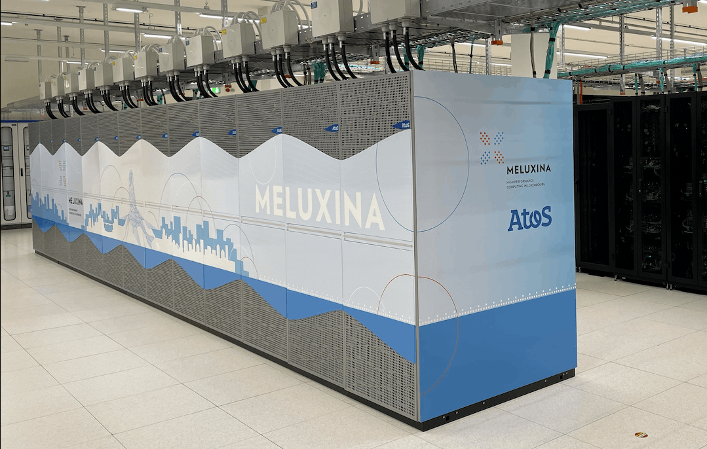

# A Rust host code executing CUDA kernel 

## Host code

- Line 1-4: we import the necessary modules. The **prelude** in Rust is a module that re-exports commonly used types and traits so you can import them all at once.
- Line 7: the `OUT_DIR` environment variable contains the path to the device code build using `build.rs`.
- Line 9-81: the run function applies the following kernel (3 X 3):

      $$
        \begin{bmatrix}
          0 & 1  & 0\\\
          1 & -4 & 1\\\
          0 & 1 & 0
        \end{bmatrix}
      $$

- We used the [cust](https://crates.io/crates/cust) crate, **a Safe, Fast, and user-friendly wrapper around the CUDA Driver API**.

=== "./code/rust-nvcc/src/main.rs"
    ```rust linenums="1" hl_lines="59-70"
    --8<-- "./code/rust-nvcc/src/main.rs"
    ```
=== "./code/rust-cuda/src/main.rs"
    ```rust linenums="1" hl_lines="65-78"
    --8<-- "./code/rust-cuda/src/main.rs"
    ```

!!! warning "Some difference with the two host code version"
    Both code should be in theory the same. Nevertheless, the device code for the `rust-cuda` crate is in Rust and care should be taken when launching the kernel. 
    According to the Rust-CUDA [Kernel ABI](https://rust-gpu.github.io/rust-cuda/guide/kernel_abi.html), immutable slices should be passed via pointer/length pairs while buffers only requires a pointer.
    The reason behind this is the approach taken by Rust-CUDA 
    > The Rust CUDA Project is a project aimed at making Rust a tier-1 language for GPU computing using the CUDA Toolkit. It provides tools for **compiling Rust to fast PTX** code as well as libraries for using existing CUDA libraries with it.

    So writing kernel in Rust requires the use of the LLVM PTX backend. The device Rust code is translated to PTX using the `rustc_codegen_nvvm` tool.

    > The `rustc_codegen_nvvm` is a rustc backend that targets NVVM IR (a subset of LLVM IR) for the libnvvm library.Generates highly optimized PTX code which can be loaded by the CUDA Driver API to execute on the GPU.For now it is CUDA-only, but it may be used to target AMD GPUs in the future.

    For more details, please have a look at [https://rust-gpu.github.io/rust-cuda/guide/getting_started.html](https://rust-gpu.github.io/rust-cuda/guide/getting_started.html)

## Device code

### C/C++ device code: building the CUDA kernel with `nvcc` 

```cpp title="./code/rust-nvcc/kernels/conv2d_gray_f32.cu" linenums="1"
--8<-- "./code/rust-nvcc/kernels/conv2d_gray_f32.cu"
```

```rust title="./code/rust-nvcc/build.rs" linenums="1"
--8<-- "./code/rust-nvcc/build.rs"
```

### Rust device code: building the CUDA kernel with `Rust-CUDA` 

```rust title="./code/rust-cuda/kernels/src/lib.rs" linenums="1"
--8<-- "./code/rust-cuda/kernels/src/lib.rs"
```

!!! warning "Access data in the Rust kernel"
    `input` and `weights` are normal slices but the output  is a raw pointer. Since output is mutable state shared by multiple kernels executing in parallel.

    > Using &mut [T] would incorrectly indicate that it is non-shared mutable state, and therefore Rust CUDA does not allow mutable references as argument to kernels. Raw pointers do not have this restriction. Therefore, we use a pointer and only make a mutable reference once we have an element (c.add(i)) that we know won’t be touched by other kernel invocations.

    For more details, please have a look at [https://rust-gpu.github.io/rust-cuda/guide/getting_started.html](https://rust-gpu.github.io/rust-cuda/guide/getting_started.html)

!!! warning "Shared memory in the Rust kernel"
    - Shared GPU memory is modelled with `#[address_space(shared)] static mut`
    - Unlike standard `static mut`, it is not initialized, and only exists for the duration of the kernel's
    (multi-)execution
    - Because it is not initialized, it must be marked with `MaybeUninit`
    - Every `write` attempt requires an unsafe block because writing a `static mut` is always unsafe
    - Every `read` should subsequently used `assume_init`.


```rust title="./code/rust-cuda/build.rs" linenums="1"
--8<-- "./code/rust-cuda/build.rs"
```

## Execution on MeluXina

### Interactive execution
 
```bash linenums="1"
salloc -A <project_name> -t 30:00 -q default -p gpu
cd ${HOME}/RustOnAccelerators/code
source setup_rustgpu.sh
```

=== "Rust-nvcc"
    ```bash linenums="1"
    cd ${CODE_ROOT}/rust-nvcc 
    cargo build --release
    # Execute the code
    ./target/release/rust-nvcc -orust-nvcc-image.png ../../data/original_image.png
    ```


=== "Rust-cuda"
    ```bash linenums="1"
    cd ${CODE_ROOT}/rust-cuda
    cargo build --release
    # Execute the code
    ./target/release/rust-cuda -orust-cuda-image.png ../../data/original_image.png
    ```
### Batch execution

```bash
cd ${HOME}/RustOnAccelerators/code
sbatch -A <project_name> launcher-rust-nvcc-cuda.sh
```
## Results


- You should see the following results for both executions:


| <center markdown="1"></center> | <center markdown="1"></center>|
|----------------------------------------------------------------|---------------------------------------------------------------|
| <center>Original</center>                                      | <center>Convolution</center>                                  |


## Explore Further

- Try to modify the kernel coefficients
- Try to change the original image
- Adapt the code for Tiled Matrix Multiplication


